# LazyGUI

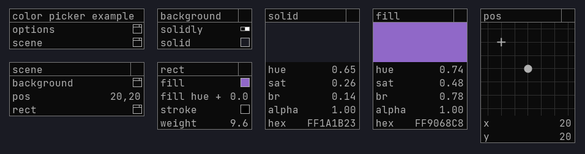

GUI library for creative coding with Processing 3+ with a focus on easy iteration. 

### Main features:
- no gui logic in `setup()`
- lazy initialization of folders and controls when a value is first requested
- control elements have unique string paths
- this lets you keep all the gui logic in `draw()` next to the code that uses it

### Supporting features:
- infinite sliders with variable precision
- keyboard input for text and slider values
- copy / paste any value or whole folders
- undo / redo any change
- load / save your gui state to disk as json
- autosave on program exit
- utility methods for gui paths
- [reload shaders at runtime](src/main/java/lazy/ShaderReloader.java)
- configurable look and feel
  - pre-made and custom color themes
  - custom fonts (JetBrains Mono by default)
  - background dot grid
  - contextual guidelines between a child folder and its parent
  - individual windows have resizable width

## How do I run this?

First get the jar from [releases](https://github.com/KrabCode/LazyGui/releases) and then drag & drop it into your Processing
editor window. If you are using a full IDE like IntelliJ, import the jar as a standard java library just like you imported Processing.

#### Runnable basic example:
```java
LazyGui gui;

void setup(){
    size(800,800,P2D);
    gui = new LazyGui(this);
}

void draw(){
    background(gui.colorPicker("bg").hex);
}
```
The gui displays itself at the end of `draw()` and by default it shows the root folder with an inner "options" folder for tweaking the various gui settings. 

A sketch with the above code should look like this:

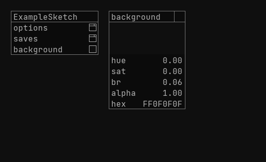

## Get values from the GUI

### Slider
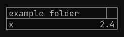
```java
float x = gui.slider("x");
```
- mouse wheel changes the selected precision when mouse is over the slider
- click and drag mouse horizontally - change value by (pixels * precision)
- supports keyboard input with mouse over the slider - tries to parse the string as Float or Int
- there is a `sliderInt()` variant that returns `int`

### Plot
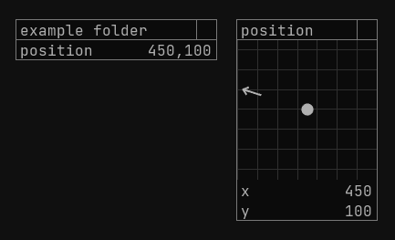
```java
PVector pos = gui.plotXY("position");
```
- drag the grid with your mouse to change both X and Y at the same time
- keyboard input for both values with mouse over the grid
- change both of their precisions at the same time with the mouse wheel over the grid
  - change just one of their precisions with mouse over one of the x,y sliders
- there is a `plotXYZ()` variant with an extra Z slider (not connected to the grid)

### Button
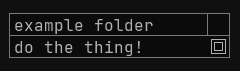
```java
if(gui.button("do the thing!")){
    println("it is done");
}
```
- is only true once after being clicked (returning true switches the value back to false)

### Toggle
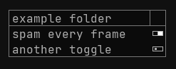
```java
if(gui.toggle("spam every frame")){
    println("I'm trapped in a string factory");
}
```
- click to flip the boolean state

### Text input
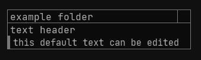
```java
String userInput = gui.text("text header", "this default text can be edited");
```
- type with mouse over the text field
- ENTER - insert new line 
- DELETE  - delete the whole text
- BACKSPACE - delete the last character

### Radio
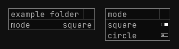
```java
String mode = gui.radio("mode", new String[]{"square", "circle"});
if (mode.equals("square")) {
    rect(175, 175, 50, 50);
} else {
    ellipse(200, 200, 50, 50);
}
```
- opens a folder of toggles where setting one to true sets all others to false
- returns the selected option as a string

### Color picker
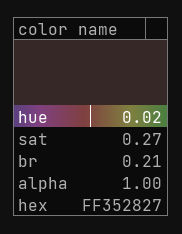
```java
int pickedColor = gui.colorPicker("color name").hex;
background(pickedColor);
```
- HSBA color picker with a hex string display
- you can copy and paste using the hex field

### Gradient picker
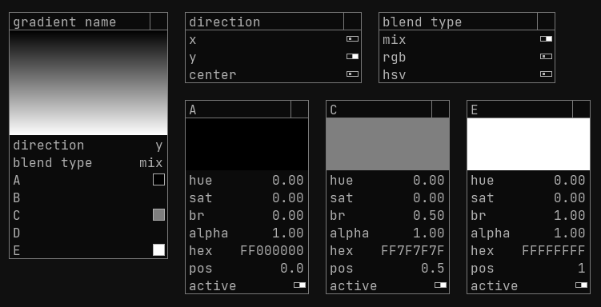
```java
PGraphics gradient = gui.gradient("gradient name");
image(gradient, 0, 0);
```
- allows you to set the position and value of individual colors or disable them entirely
- blend type supports three color mixing algorithms (mix, rgb, hsv - see [gradient.glsl](data/shaders/gradient.glsl))

## Paths and folders

The **path**  is the first string parameter to every control element function, and it must be unique.
It exists only in memory to inform the GUI - it's not a directory structure in any file storage.
The forward slash `/` is a reserved character used to make folders, but it can be escaped with `\\` like this: `\\/` which won't separate folders.

##### Creating a folder with the forward slash
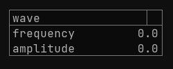
```java
float frq = gui.slider("wave/frequency");
float amp = gui.slider("wave/amplitude");
```

#### Escaping the forward slash
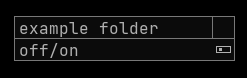
```java
boolean state = gui.toggle("off\\/on");
```

## Global path prefix stack

Repeating the whole path in every control element call can get tiresome, especially with multiple nested levels.
Which is why there is a helpful path stack that you can interact with using `pushFolder()` and `popFolder()`.

Just like using `pushMatrix()` and `popMatrix()` in Processing, you can change your "current directory"
by pushing a new folder name to a stack with `gui.pushFolder("folder name")` and have every control element called after that be placed into that folder automatically
as if the contents of the whole current stack got prefixed to every path parameter you use while calling the GUI.

- `popFolder()` doesn't have a parameter - it just returns by one level

You can nest a `pushFolder()` inside another `pushFolder()` - your path stack can be many levels deep.
Just remember to call `popFolder()` the same number of times - the stack does get cleared after the end of draw() before the GUI starts drawing itself, but it's better not to rely on that.


#### Folder made by using the stack
```java
gui.pushFolder("wave");
float frq = gui.slider("frequency");
float amp = gui.slider("amplitude");
gui.popFolder();
```

##### See the current stack for debugging
```java
println(gui.getFolder());
```

### Hide and show anything
You can hide folders and single elements from code, while still receiving their values in code - the only change is visual. 
This is helpful when you have a list of autogenerated folders whose paths differ only by the 'i' in a loop, and you create 10 folders and then decrease the limit - you want to extra folders to go away to not clutter up your screen when unused.
You can also use this to hide the default 'options' folder.

```java 
gui.hide("myPath") // hide anything at this path (the prefix stack applies here like everywhere else)
gui.show("myPath") // reveal anything previously hidden at this path
gui.hideCurrentFolder() // hide the folder at the current path prefix stack
gui.showCurrentFolder() // show the folder at the current path prefix stack if it has been previously hidden 
``` 

### More example code
- [processing examples](src/main/java/examples) 
- [pure java examples](src/main/java/examples_intellij) for use in a proper IDE like IntelliJ IDEA
- bigger sketches using this GUI in my other repo: [LazySketches](https://github.com/KrabCode/LazySketches) 

### How to contribute
- For questions or suggestions please [create a new issue](https://github.com/KrabCode/LazyGui/issues)
- Feel free to fork the repository and submit a pull request